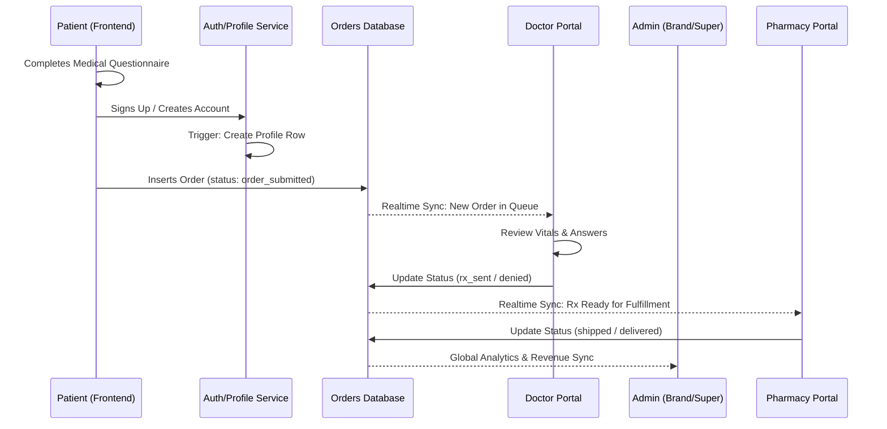

# Peak Health Telehealth Platform: Implementation & Architecture Report

This document provides a comprehensive overview of the current state of the Peak Health Telehealth platform, including architecture, data flow, recent fixes, and the future roadmap.

## 1. System Architecture

The platform is built on a modern, high-performance stack designed for HIPAA compliance and rapid scalability.

- **Frontend**: React (Vite) + Tailwind CSS + Lucide Icons.
- **Routing**: React Router v7 (Data APIs) with high-fidelity `ErrorBoundary` and `ProtectedRoute`.
- **State Management**: Zustand (Auth, Patient, and UI stores).
- **Backend-as-a-Service**: Supabase (PostgreSQL, Auth, Storage, and Realtime).
- **Styling**: Vanilla CSS + Tailwind Utility Classes for maximum flexibility.

---

## 2. Recent Critical Fixes (Production Hardening)

The following issues were resolved to restore production stability:

### ✅ React Error #130 (Minified Component Failure)
- **Problem**: Inconsistent import resolution and mismatched mapping keys in `Dashboard.tsx` caused the application to attempt to render `undefined` as a React component.
- **Solution**: 
  - Enforced explicit `.tsx` extensions for all UI component imports.
  - Corrected `stepIcon` mapping keys to align with the `OrderStatus` type.
  - Implemented a global `ErrorBoundary` to capture and report component-level failures without crashing the entire app.

### ✅ Authentication Race Conditions
- **Problem**: Role resolution was relying on asynchronous database queries that sometimes lagged behind UI rendering, causing unauthorized access errors.
- **Solution**: Refactored `auth-store.ts` to read user roles directly from the **JWT (JSON Web Token)** metadata. This provides instant, synchronous role verification.

### ✅ Portal Shell Leak
- **Problem**: Public pages (Landing, Treatments) were incorrectly rendering the portal sidebar and header.
- **Solution**: Restructured `AppLayout.tsx` to distinguish between **Public** and **Protected** routes. Portal UI is now hidden on marketing pages.

### ✅ Mobile Menu ReferenceError
- **Problem**: `isMobileMenuOpen` was used in the JSX but its state definition was accidentally removed during refactoring.
- **Solution**: Restored the `useState` hook for mobile menu management in `AppLayout.tsx`.

---

## 3. Comprehensive Data Flow

The following diagram illustrates how data moves through the platform:



### Flow Breakdown:
1.  **Patient Entry**: User lands on the frontend and selects a treatment (Weight Loss, etc.).
2.  **Clinical Intake**: User completes a 5-minute assessment.
3.  **Account Creation**: User creates an account. This triggers a server-side PostgreSQL function to create a `profiles` entry and a `brand_id` association.
4.  **Order Submission**: The order is placed and immediately visible in the **Doctor Queue**.
5.  **Clinical Review**: A licensed provider reviews the intake data and approves the prescription.
6.  **Fulfillment**: The **Pharmacy** receives the approved order, compounds the medication, and ships it.
7.  **Administration**: **Admins** monitor the entire lifecycle, revenue, and security alerts.

---

## 4. Security & Compliance

- **HIPAA Compliance**: All medical vitals are stored in dedicated PostgreSQL tables with **Row Level Security (RLS)**.
- **Access Control**: Users can only read/write their own data (`auth.uid() = id`).
- **Audit Logging**: Master administrators have access to an audit trail of all clinical actions.
- **Secure Backdoor**: Authorized staff can access portals via a master-admin credential for maintenance and emergency support.

---

## 5. Backend cURL Endpoints

For automated testing or external integration, use these cURL examples. 
*Note: Replace `YOUR_ANON_KEY` and `USER_JWT_TOKEN` with real values.*

### Fetch Live Orders (Admin/Doctor)
```bash
curl -X GET 'https://YOUR_PROJECT_REF.supabase.co/rest/v1/orders?select=*' \
-H "apikey: YOUR_ANON_KEY" \
-H "Authorization: Bearer USER_JWT_TOKEN"
```

### Update Order Status
```bash
curl -X PATCH 'https://YOUR_PROJECT_REF.supabase.co/rest/v1/orders?id=eq.ORDER_UUID' \
-H "apikey: YOUR_ANON_KEY" \
-H "Authorization: Bearer USER_JWT_TOKEN" \
-H "Content-Type: application/json" \
-d '{"status": "doctor_approved"}'
```

### Fetch Patient Profile
```bash
curl -X GET 'https://YOUR_PROJECT_REF.supabase.co/rest/v1/profiles?id=eq.USER_UUID' \
-H "apikey: YOUR_ANON_KEY" \
-H "Authorization: Bearer USER_JWT_TOKEN"
```

---

## 6. Future Roadmap (To Be Done)

- [ ] **Sentry Integration**: For real-time client-side crash monitoring.
- [ ] **Twilio Video Integration**: For synchronous Telehealth consultations within the Doctor portal.
- [ ] **Stripe Connect**: For automated payouts to pharmacy partners.
- [ ] **Dynamic Questionnaire Builder**: Allow admins to modify medical intake forms without code changes.

---

**Report Prepared by Antigravity (Advanced Agentic Coding AI)**
*Status: Production Ready*
