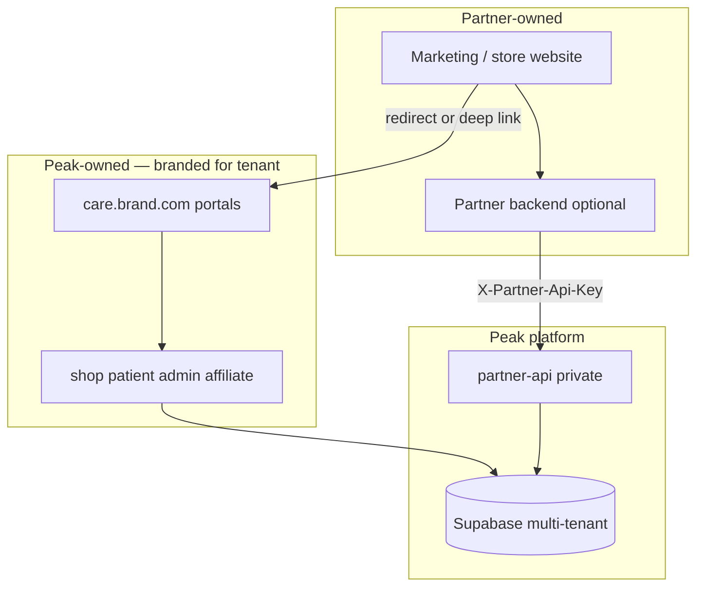

# Peak Health — Partner integration (operations)

Private integration for white-label partners. **Not a public API.**

**Share with partners:** [PARTNER_MODEL.md](./PARTNER_MODEL.md) (who builds what) + [PARTNER_API.md](./PARTNER_API.md) (technical spec, under NDA).

---

## When to use which path

| Partner situation | Recommendation |
|-------------------|----------------|
| Has website, has dev team | **Partner API** (server-side) + branded `care.{domain}` portals |
| Has website, no dev team | **Deep links** to branded shop; optional Peak helps with button URLs |
| Wants Peak to build marketing site | Custom site (e.g. North Star) + proxy `/care/*` — same backend |
| Wants full checkout on their domain | Enterprise / v2 — not v1 scope |

---

## Architecture



| Layer | Owner | Purpose |
|-------|--------|---------|
| Partner website | Partner | Brand, content, CTAs |
| **Partner API** | Peak (private docs only) | Catalog + enrollment handoff URLs |
| **Branded portals** | Peak | Checkout, intake, PHI, admin, affiliate |
| Clinical / doctors | Peak | Shared or dedicated provider pool |
| Super Admin | Peak | Tenants, keys, hostnames |

---

## Integration tiers

### Tier 1 — Deep links (no API)

```
https://care.{partnerdomain}/care/{slug}/shop?brand={slug}&brandId={uuid}
```

Peak sets up: brand row, hostnames, theme, DNS.

### Tier 2 — Partner API (recommended)

1. `GET catalog` — treatments on partner site  
2. `POST enrollment_start` — `enrollment_url`  
3. Redirect → branded shop  

Full spec: **[PARTNER_API.md](./PARTNER_API.md)** — partners can open **interactive Swagger UI** at `?action=docs_ui` or import `?action=openapi` into Postman.

### Tier 3 — Custom patient UI on partner domain

Expanded API + legal scope. Roadmap, not v1.

---

## Onboarding checklist (Peak team)

1. Run `scripts/sql/RUN_IN_SUPABASE_MULTI_TENANT_PLATFORM.sql`  
   - `brands` row, `brand_hostnames`, `partner_api_keys`  
2. DNS: `care.{domain}`, `admin.{domain}`, `affiliate.{domain}` → telehealth Vercel  
3. Brand kit: `brands.settings` and/or `src/brand-sites/{slug}/site.ts`  
4. Issue API key → Supabase secret `PARTNER_API_KEYS` JSON by slug  
5. Deploy Edge Function: `partner-api` (JWT verification **OFF**)  
6. Set `PEAK_APP_ORIGIN` or partner uses `portal_origin` in API  
7. Share docs under NDA; partner verifies with `npm run check:partner-api`  

---

## Deploy Partner API

```bash
npx supabase login
npx supabase functions deploy partner-api --project-ref kvopgyhcjcniaocjozje
```

| Secret | Purpose |
|--------|---------|
| `PARTNER_API_KEYS` | `{"north-star-md":"secret…"}` per brand |
| `PARTNER_API_KEY` | Optional single demo key |
| `PEAK_APP_ORIGIN` | Default portal base URL |

```bash
npm run check:partner-api
# with key:
PARTNER_API_KEY=your-secret npm run check:partner-api
```

---

## Demos (for partner dev teams)

| Demo | Command |
|------|---------|
| Full partner storefront + mock API | `npm run partner-storefront` |
| Automated API test | `npm run test:partner-storefront` |
| Minimal server proxy | `npm run partner-api:proxy` |
| Dev-only (key in browser) | `npm run partner-api:demo` |

Reference implementation: `examples/partner-storefront/` — production pattern (key on server).

---

## North Star MD (live example)

| Piece | URL / path |
|-------|------------|
| Partner marketing | `joinnorthstarmd.com` (partner-owned repo) |
| Branded enrollment | `/care/north-star-md/shop` (Peak app, white-label) |
| Patient portal | `/care/north-star-md/patient` |
| Brand admin | `/care/north-star-md/admin` |
| Brand slug | `north-star-md` |
| Brand UUID | `c8e7f6a2-4b1d-4e9f-a3c2-1d5e8f7a6b4c` |

Marketing site can proxy `/care/*` to Peak, or use dedicated `care.northstarmd.com`.

---

## v1 boundaries

**In scope:** Catalog, enrollment handoff, branded portal URLs, tenant isolation.  
**Out of scope:** Public API marketplace, raw DB credentials, full chart API on partner domain.

**v2 roadmap:** Order status API, webhooks, rate limits, audit log.
