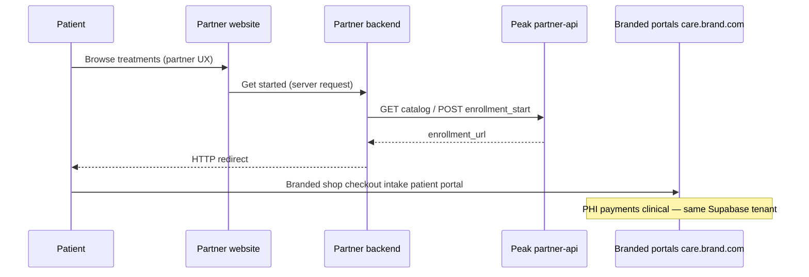

# White-label partner model — who builds what

**For:** Partners who **already have** (or want to own) their marketing website, homepage, or online store.  
**Not:** A public API. Integration docs and API keys are shared **only under contract / NDA**.

---

## The short answer (Brandon’s question)

> *“They already have their front website — how do they connect?”*

**They keep their website.** Peak hosts **branded clinical portals** on a subdomain (e.g. `care.partner.com`). Connection is either:

1. **Simple links** — “Get started” buttons go straight to the branded shop (no API), or  
2. **Private Partner API** — their **server** (not browser) calls Peak for catalog + enrollment URL, then **redirects the patient** into our branded portals.

**PHI, checkout, intake, doctor queue, and patient chart never live on the partner’s marketing site.** One Supabase backend; tenant isolated by `brand_id` / `sub_brand`.

---

## Who owns what

| Layer | Owner | Examples |
|-------|--------|----------|
| Marketing site | **Partner** | `joinpartner.com`, WordPress, Shopify landing, custom React |
| Private Partner API | **Peak** (credentials per partner) | `catalog`, `enrollment_start`, portal URLs |
| Branded care portals | **Peak** (white-label UI) | Shop, patient login, patient dashboard |
| Brand admin / affiliate | **Peak** (white-label UI) | `care.partner.com/…/admin`, affiliate portal |
| Doctors / clinical ops | **Peak** | Provider queue, eRx, RPM (Peak or shared pool) |
| Database & PHI | **Peak** (Supabase) | Orders, profiles, messages — scoped by brand |

Peak **does not have to build** the partner’s homepage. We **do** brand the portals the patient and partner staff use after handoff.

---

## Recommended flow (partner already has a site)



**Production rule:** `X-Partner-Api-Key` only on the **partner’s server**. Never in public JavaScript.

---

## Integration options

### Option A — Deep links only (fastest, no API)

Partner hard-codes or CMS-manages links:

```text
https://care.northstarmd.com/care/north-star-md/shop?brand=north-star-md&brandId=<uuid>
```

Peak provisions DNS + white-label theme. Good for launch in days.

### Option B — Partner API (recommended when they have dev team)

| Step | Call | Purpose |
|------|------|---------|
| 1 | `GET catalog` | Render treatments/prices on **their** site |
| 2 | `POST enrollment_start` | Get `enrollment_url` for this patient/session |
| 3 | Browser redirect | Patient enters **branded** Peak shop |

Spec: [PARTNER_API.md](./PARTNER_API.md)  
Working demo: `npm run partner-storefront`

### Option C — Peak builds marketing site (optional)

North Star path today: Peak/northstar team builds `joinnorthstarmd.com`, proxies `/care/*` to Peak app. **Same portals and backend** — only who builds the marketing layer differs.

---

## What we brand for each client

Configured in Supabase + frontend brand kit:

- Logo, colors, copy on `/care/{slug}/shop`, `/login`, `/patient/*`
- Brand admin: `/care/{slug}/admin/*`
- Affiliate: `/care/{slug}/affiliate/*`
- Optional hostnames: `care.{domain}`, `admin.{domain}`, `affiliate.{domain}`

SQL: `scripts/sql/RUN_IN_SUPABASE_MULTI_TENANT_PLATFORM.sql`

---

## What the API is **not**

- Not listed on a public developer portal  
- Not self-serve API keys  
- Not access to raw Supabase or full patient chart on partner domain  
- Not a replacement for HIPAA-aligned portals (those stay on Peak)

v1 API = **marketing → enrollment handoff** + catalog. Order status webhooks = v2 roadmap.

---

## Peak onboarding checklist (real system)

1. **Contract / NDA** → share [PARTNER_API.md](./PARTNER_API.md) + this doc  
2. **SQL** → run multi-tenant script (brand row, hostnames, partner key)  
3. **DNS** → `care.{partnerdomain}` → Peak Vercel project  
4. **Brand kit** → `brands.settings` + optional `src/brand-sites/{slug}/`  
5. **Deploy** → `partner-api` Edge Function + `PARTNER_API_KEYS` secret  
6. **Verify** → `npm run check:partner-api`  
7. **Partner** → integrate server-side (see `examples/partner-storefront/`)

---

## One-line pitch for partners

*“You keep your website and brand story; we host the compliant telehealth shop, patient portal, and clinical stack under your branded subdomain — your dev team connects with a private API, or you can start with simple links.”*
