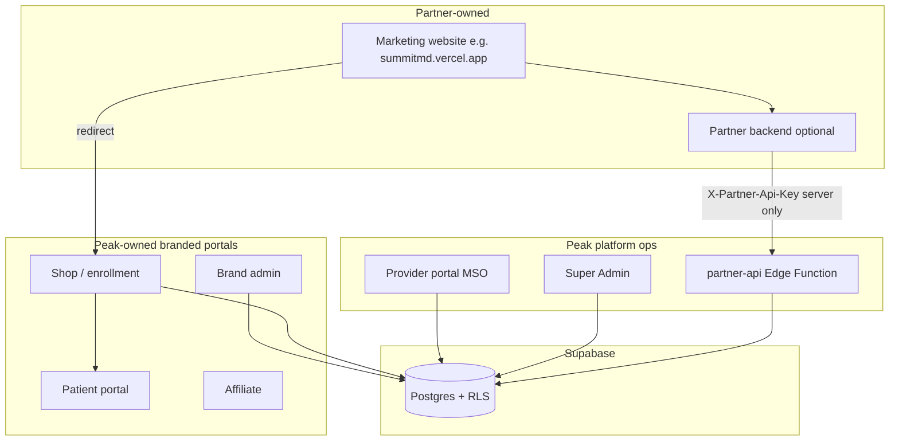
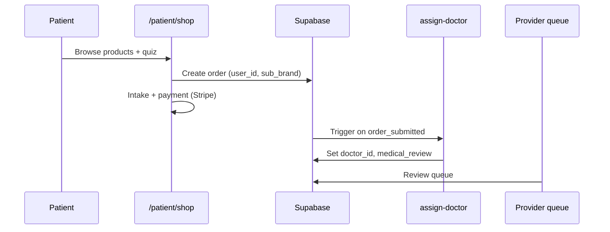
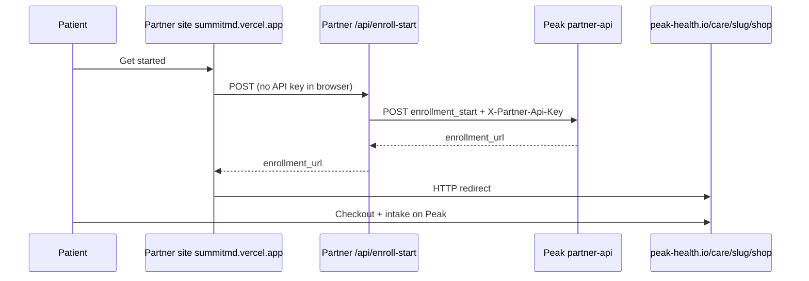

# Peak Health Platform — Master Guide

**The complete reference for operators, engineers, clinical staff, and white-label partners.**

This document consolidates how Peak Health works end-to-end: every portal, the Partner API, products, enrollment, doctor assignment, database setup, what to send partner developers, and how to go live. It is intended to be the **single starting point** before diving into specialized docs.

**Production app:** [https://www.peak-health.io](https://www.peak-health.io)  
**Supabase project (current):** `vzzmdbdvcofajgrjgajq`  
**Partner API base:** `https://vzzmdbdvcofajgrjgajq.supabase.co/functions/v1/partner-api`

---

## Table of contents

1. [Executive summary](#1-executive-summary)
2. [Who builds what (partner model)](#2-who-builds-what-partner-model)
3. [All portals — URLs, roles, and access](#3-all-portals--urls-roles-and-access)
4. [Authentication and sessions](#4-authentication-and-sessions)
5. [Products and catalog](#5-products-and-catalog)
6. [Patient enrollment flows](#6-patient-enrollment-flows)
7. [Clinical routing — video vs async](#7-clinical-routing--video-vs-async)
8. [Doctor assignment and provider network](#8-doctor-assignment-and-provider-network)
9. [Order lifecycle and statuses](#9-order-lifecycle-and-statuses)
10. [Partner API — complete reference](#10-partner-api--complete-reference)
11. [Connecting Partner API docs (Swagger)](#11-connecting-partner-api-docs-swagger)
12. [Partner developer handoff packet](#12-partner-developer-handoff-packet)
13. [Summit MD example (live partner)](#13-summit-md-example-live-partner)
14. [North Star MD example (reference partner)](#14-north-star-md-example-reference-partner)
15. [White-label brands and DNS](#15-white-label-brands-and-dns)
16. [Brand Admin vs Super Admin](#16-brand-admin-vs-super-admin)
17. [Database setup — SQL run order](#17-database-setup--sql-run-order)
18. [Staff accounts and provisioning](#18-staff-accounts-and-provisioning)
19. [Edge functions](#19-edge-functions)
20. [Verification and smoke tests](#20-verification-and-smoke-tests)
21. [Production launch checklist](#21-production-launch-checklist)
22. [Security and compliance notes](#22-security-and-compliance-notes)
23. [Troubleshooting](#23-troubleshooting)
24. [Glossary](#24-glossary)
25. [Related documents index](#25-related-documents-index)

---

## 1. Executive summary

Peak Health is a **multi-tenant telehealth platform** built on:

- **Frontend:** React + Vite SPA deployed on Vercel (`peak-health.io`)
- **Backend:** Supabase (Postgres + Auth + Row Level Security + Edge Functions)
- **Payments:** Stripe
- **Pharmacy:** Edge dispatch to fulfillment partners
- **Scheduling:** Calendly / Cal.com embeds + Zoom for live visits

### Three ways patients enter the system

| Entry path | Who owns the marketing UI | Where checkout happens |
|------------|---------------------------|-------------------------|
| **Peak native** | Peak Health | `/patient/shop` or `/care/{slug}/shop` |
| **White-label deep link** | Partner | Branded Peak shop URL |
| **Partner API handoff** | Partner (own site) | Redirect to branded Peak shop after `enrollment_start` |

**PHI never lives on partner marketing sites.** After handoff, patients use Peak-branded portals for checkout, intake, messaging, prescriptions, and records.

### Core principle

One Supabase database. Tenants isolated by `brands`, `sub_brand` on orders, `brand_id` on profiles, and RLS policies using `get_auth_role()` and `get_auth_brand()`.

---

## 2. Who builds what (partner model)



| Layer | Owner | Examples |
|-------|--------|----------|
| Marketing / storefront UX | **Partner** (or Peak for native) | summitmd.vercel.app, peak-health.io landing |
| Private Partner API | **Peak** | `catalog`, `enrollment_start`, portal URLs |
| Branded care portals | **Peak** (white-label theme) | Shop, patient login, patient dashboard |
| Brand admin / affiliate | **Peak** (scoped to brand) | `/care/{slug}/admin`, affiliate portal |
| Doctors / clinical | **Peak** (shared MSO pool) | `/providers` queue, eRx, RPM |
| Super Admin | **Peak** only | Cross-brand brands, keys, doctors |
| Database & PHI | **Peak** (Supabase) | orders, profiles, messages |

See also: [PARTNER_MODEL.md](./PARTNER_MODEL.md)

---

## 3. All portals — URLs, roles, and access

### 3.1 Production URLs (Peak Health apex)

| Portal | Login URL | Home after login | Required role |
|--------|-----------|------------------|---------------|
| **Patient** | `/login` or `/patient/login` | `/patient` | `patient` |
| **Provider (Doctor)** | `/providers/login` or `/doctor/login` | `/providers` | `doctor` |
| **Brand Admin** | `/admin/login` | `/admin` | `brand_admin` |
| **Super Admin** | `/superadmin/login` | `/superadmin` | `super_admin` only |
| **Affiliate** | `/affiliate/login` | `/affiliate` | `affiliate` |
| **Pharmacy** | `/pharmacy/login` | `/pharmacy` | `pharmacy` |

**Subdomains (Vercel redirects):**

| Host | Maps to |
|------|---------|
| `admin.peak-health.io` | `/admin` |
| `superadmin.peak-health.io` | `/superadmin` |
| `doctors.peak-health.io` | `/providers` |
| `patient.peak-health.io` | `/patient` |
| `affiliate.peak-health.io` | `/affiliate` |

### 3.2 White-label URLs (`/care/{brandSlug}/…`)

For partners like **North Star MD** or **Summit MD**:

| Portal | Path pattern |
|--------|--------------|
| Enrollment / shop | `/care/{slug}/shop` |
| Patient login | `/care/{slug}/login` |
| Patient portal | `/care/{slug}/patient` |
| Brand admin login | `/care/{slug}/admin/login` |
| Brand admin app | `/care/{slug}/admin` |
| Affiliate login | `/care/{slug}/affiliate/login` |

**There is no** `/care/{slug}/superadmin`. Platform super admin always uses Peak `/superadmin`.

**Doctors** use the shared MSO portal: `/providers/login` (not per-brand).

### 3.3 Provisioned staff accounts (demo / ops)

After `npm run auth:provision-staff` (requires SQL helpers):

| Portal | Email | Password (change in prod) | Role |
|--------|-------|---------------------------|------|
| Super Admin | `brandon@peakbodyco.com` | (set in provision script) | `super_admin` |
| Provider | `doctor@peakbodyco.com` | `password123` | `doctor` |
| Brand Admin | `admin@peakbodyco.com` | `password123` | `brand_admin` |
| Pharmacy | `pharmacy@peakbodyco.com` | `password123` | `pharmacy` |
| Affiliate | `affiliate@peakbodyco.com` | `password123` | `affiliate` |

Verify: `npm run verify:portals`

### 3.4 What each portal can do

#### Patient portal (`/patient` or `/care/{slug}/patient`)

- Shop / enroll in treatments
- Order tracking and timeline
- Appointments (Calendly / Zoom)
- Intake forms and visit forms
- Messages with assigned doctor
- Prescriptions, labs, documents, vitals
- Profile, identity verification, family access

#### Provider portal (`/providers` or `/doctor`)

- **Queue** — orders needing review, refills
- **Patients** — registry built from orders (deduped by patient)
- **Messages** — filtered by `orders.doctor_id`
- Consult, scribe, eRx dispatch, labs, RPM, schedule, availability
- Sees **all orders** per RLS (MSO shared pool), not only assigned rows in queue UI

#### Brand Admin (`/admin` or `/care/{slug}/admin`)

- Orders, patients (operations view — **non-clinical** columns)
- Products, questionnaires, treatments, builders
- Finance, discounts, affiliates (if enabled)
- **Scoped to brand** via `sub_brand` / `brand_id`
- Does **not** receive full intake/vitals in global order store (admin fetch mode)

#### Super Admin (`/superadmin`)

- Everything brand admin has, **cross-brand**
- **Brands** — create partners, issue API keys, hostnames
- **Doctors** — invite, licenses, Calendly URLs
- **All users**, security, platform tools
- Only role allowed on `/superadmin/*` routes

#### Affiliate (`/affiliate`)

- Referral links, payouts (Referly integration)
- Bridge may redirect to external Referly white-label portal

#### Pharmacy (`/pharmacy`)

- Fulfillment queue (when enabled)

### 3.5 Portal access matrix

| Role | Patient | Provider | Admin | Super Admin | Affiliate | Pharmacy |
|------|---------|----------|-------|-------------|-----------|----------|
| `patient` | ✅ | ❌ | ❌ | ❌ | ❌ | ❌ |
| `doctor` | ❌ | ✅ | ❌ | ❌* | ❌ | ❌ |
| `brand_admin` | ❌ | ❌ | ✅ | ❌ | ❌ | ❌ |
| `super_admin` | ✅** | ✅ | ✅ | ✅ | ✅ | ✅ |
| `affiliate` | ❌ | ❌ | ❌ | ❌ | ✅ | ❌ |
| `pharmacy` | ❌ | ❌ | ❌ | ❌ | ❌ | ✅ |

\* Super admin can open provider URLs but login redirect sends them to `/superadmin` by default.  
\** Super admin can open patient routes for support/debug.

### 3.6 Multi-tab behavior

Auth tokens are stored in **`sessionStorage`** (key: `peak-health-auth`), so each browser tab can hold a **different portal login** without overwriting another tab.

---

## 4. Authentication and sessions

### 4.1 Role resolution order

From `src/lib/auth-store.ts`:

1. JWT `app_metadata.role` (preferred — set via Admin API)
2. JWT `user_metadata.role`
3. Fallback: `profiles.role` for the user id

Brand scope for admins: `app_metadata.brand_id` → must align with `orders.sub_brand`.

### 4.2 Login portal enforcement

Each login screen enforces role:

- `/superadmin/login` → **`super_admin` only**
- `/admin/login` → `brand_admin` or `super_admin`
- `/providers/login` → `doctor` or `super_admin`
- Wrong portal → clear message + link to correct portal

### 4.3 Database setup for auth

Run in order:

1. `scripts/sql/RUN_IN_SUPABASE_FIX_ALL_DATABASE.sql` (fresh DB)
2. `scripts/sql/RUN_IN_SUPABASE_SCHEMA_GAP_FIX.sql`
3. `scripts/sql/RUN_IN_SUPABASE_STAFF_AUTH_ALL.sql`
4. `scripts/sql/RUN_IN_SUPABASE_AUTH_500_FIX.sql` (if login 500)
5. Locally: `npm run auth:provision-staff`

---

## 5. Products and catalog

### 5.1 Where products live

Table: **`public.products`**

Key columns:

| Column | Purpose |
|--------|---------|
| `id` | UUID — used in Partner API `product_id` |
| `name`, `category`, `tagline` | Display |
| `price_usd` | Price |
| `active` | Must be `true` for catalog |
| `features` | JSONB — routing, video, questionnaire, gateways |
| `questionnaire` | Intake questions (JSONB array) |

**Public read:** Active products are selectable by anon/authenticated users (shop catalog).

**Writes:** `brand_admin` and `super_admin` via admin/superadmin Products UI.

### 5.2 Product `features` JSON (clinical routing)

Common keys inside `features`:

| Key | Purpose |
|-----|---------|
| `requires_video_consult` | Force sync video path |
| `video_required_states` | Array of state codes |
| `scheduling_embed_url` | Calendly/Cal.com URL |
| `questionnaire` | Inline questions (or link to `admin_questionnaires`) |
| Payment gateway flags | Stripe, etc. |

Configure in: **Admin → Products** or **Super Admin → Products & protocols**.

### 5.3 Categories (shop)

Typical Peak categories: `weight-loss`, `sexual-wellness`, `hair-loss`, `longevity`, etc.

Partner storefronts may use their own category names; map them in the partner backend when calling `enrollment_start` (e.g. SummitMD `subscriptions` → Peak `weight-loss`).

### 5.4 Partner catalog API

```http
GET /functions/v1/partner-api?action=catalog&brand_slug=summit-md
X-Partner-Api-Key: pk_live_…
```

Returns active products with per-product `enrollment_url`. Partners with **their own product pages** can skip catalog and only use `enrollment_start`.

---

## 6. Patient enrollment flows

### 6.1 Native Peak flow (no partner)



Steps:

1. Patient registers / logs in
2. **Shop** — select product, vitals quiz, intake questions
3. **Routing engine** decides video vs async (Section 7)
4. Payment → order `order_submitted`
5. Auto **doctor assignment** (Section 8)
6. Patient uses **patient portal** for messages, appointments, refills

### 6.2 White-label deep link (no API)

Partner button links directly to:

```text
https://www.peak-health.io/care/summit-md/shop?brand=summit-md&brandId=7caaa526-185e-4eda-bf0e-832be6ba37a7
```

Peak handles theme via `BrandContext` + `/care/{slug}` routes.

### 6.3 Partner API flow (recommended for dev teams)



**Production rule:** API key only on **server** (Vercel function, partner backend).

### 6.4 Nine-step partner journey (contract reference)

1. Partner product page (partner UI)
2. Partner backend calls `POST enrollment_start`
3. Redirect to `enrollment_url` (`/care/{slug}/shop`)
4. Checkout (Peak portal)
5. Payment confirmation
6. Account setup
7. Two-factor + identity verification
8. Medical intake + scheduling
9. Branded patient portal (`/care/{slug}/patient`)

---

## 7. Clinical routing — video vs async

**Engine files:**

- `src/lib/videoConsultRules.ts`
- `src/lib/enrollVideoRouting.ts`
- `public.consult_routing_rules` (DB)

**Decision inputs:**

- Patient state
- Age, BMI (from intake vitals)
- Product `features.requires_video_consult`
- Product `features.video_required_states`
- Admin-defined routing rules

**Path A — Video required:**

- Show Calendly/Cal.com embed
- Pick doctor via `pickEligibleSchedulingDoctor()` (licensed in state, has calendar URL, lowest load)
- Set `orders.doctor_id` at scheduling time

**Path B — Async:**

- Order goes to physician review queue without live booking
- `assign-doctor` edge function on `order_submitted`

---

## 8. Doctor assignment and provider network

### 8.1 There is no separate patient↔doctor table

Assignment is **per order**:

- `orders.doctor_id` → UUID of provider profile
- `orders.doctor` → display name

Patient messaging uses **latest order with a doctor_id** for that patient.

### 8.2 Auto-assignment (`assign-doctor` Edge Function)

Triggered when:

- Order status = `order_submitted`
- `doctor_id` is null

Algorithm:

1. Load active doctors (`profiles.role = doctor`, `status = active`)
2. Filter by **licensed_states** containing `patient_state`
3. Pick lowest **patients_count**
4. Update order: `doctor_id`, `doctor`, status → `medical_review`
5. Increment doctor `patients_count`

### 8.3 Provider profile fields (Super Admin → Doctors)

| Field | Purpose |
|-------|---------|
| `licensed_states` | Comma-separated state codes, e.g. `CA,NY,TX` |
| `calendly_url` | Booking embed for video enrollments |
| `patients_count` | Load balancing |
| `status` | `active` / `revoked` |

### 8.4 MSO model

Doctors see **all orders** (RLS), not only assigned patients in the Patients list. Messages are filtered by `doctor_id`.

---

## 9. Order lifecycle and statuses

Typical status progression:

| Status | Meaning |
|--------|---------|
| `order_submitted` | Paid / submitted; triggers doctor assignment |
| `account_created` | Patient account linked |
| `id_verified` | Identity check complete |
| `intake_completed` | Questionnaire done |
| `medical_review` | Doctor assigned / reviewing |
| `rx_sent` | Prescription dispatched to pharmacy |
| `shipped` | Fulfillment in transit |
| `delivered` | Complete |
| `follow_up` / `refill_eligible` | Ongoing care |

Timeline stored in `orders.timeline` (JSONB).

---

## 10. Partner API — complete reference

**Base URL:**

```text
https://vzzmdbdvcofajgrjgajq.supabase.co/functions/v1/partner-api
```

**Auth header:**

```text
X-Partner-Api-Key: pk_live_…
```

**Never** expose the key in browser JavaScript.

### 10.1 Public endpoints (no key)

| Action | Method | Description |
|--------|--------|-------------|
| `health` | GET | Uptime check |
| `docs` | GET | Machine-readable index |
| `docs_ui` | GET | **Swagger UI** — interactive testing |
| `openapi` | GET | OpenAPI 3.0 JSON for Postman |

### 10.2 Authenticated endpoints

| Action | Method | Description |
|--------|--------|-------------|
| `brand` | GET | Brand metadata + all portal URLs |
| `portals` | GET | Alias for `brand` |
| `catalog` | GET | Active products + enrollment links |
| `connect` | GET | Brand-specific connect guide (curl, env template) |
| `enrollment_start` | POST | Returns `enrollment_url` for redirect |

### 10.3 `enrollment_start` body

```json
{
  "action": "enrollment_start",
  "brand_slug": "summit-md",
  "category": "weight-loss",
  "product_id": "optional-uuid",
  "portal_origin": "https://www.peak-health.io",
  "return_url": "https://summitmd.vercel.app/shop"
}
```

### 10.4 Response

```json
{
  "session_id": "uuid",
  "brand": { "id": "…", "slug": "summit-md", "name": "Summit MD" },
  "enrollment_url": "https://www.peak-health.io/care/summit-md/shop?…",
  "patient_portal_url": "…",
  "patient_login_url": "…",
  "brand_admin_url": "…",
  "affiliate_portal_url": "…",
  "provider_portal_url": "…",
  "next_step": "redirect"
}
```

### 10.5 API key storage

Keys are stored hashed in **`partner_api_keys`**. Plaintext shown **once** when issued via:

- Super Admin → Brands → Partner API → Issue key
- SQL script reveal block
- RPC `issue_partner_api_key` (super_admin only)

Alternative: Edge secret `PARTNER_API_KEYS` JSON map for bootstrap.

### 10.6 Deploy Partner API

```bash
supabase login
npx supabase functions deploy partner-api --project-ref vzzmdbdvcofajgrjgajq
```

`supabase/config.toml` sets `verify_jwt = false` for partner-api (uses API key instead).

Verify:

```bash
npm run check:partner-api
PARTNER_API_KEY=pk_live_… npm run check:partner-api
```

---

## 11. Connecting Partner API docs (Swagger)

### 11.1 Open interactive docs

Browser:

```text
https://vzzmdbdvcofajgrjgajq.supabase.co/functions/v1/partner-api?action=docs_ui
```

1. Click **Authorize**
2. Enter API key as `X-Partner-Api-Key` value
3. Try `brand`, `catalog`, `enrollment_start`

### 11.2 Import to Postman

Import → Link:

```text
https://vzzmdbdvcofajgrjgajq.supabase.co/functions/v1/partner-api?action=openapi
```

Set collection variable `apiKey` and header `X-Partner-Api-Key: {{apiKey}}`.

### 11.3 Brand connect guide (JSON)

```http
GET ?action=connect&brand_slug=summit-md
X-Partner-Api-Key: pk_live_…
```

Returns steps, curl examples, and env template for that brand.

### 11.4 Health check (no auth)

```bash
curl "https://vzzmdbdvcofajgrjgajq.supabase.co/functions/v1/partner-api?action=health"
```

Expected: `{"ok":true,"service":"partner-api","version":"1.0.0",…}`

If `NOT_FOUND` → deploy edge function (Section 10.6).

---

## 12. Partner developer handoff packet

Copy/paste this section (with real values) when onboarding a partner dev team.

---

### PEAK HEALTH — PARTNER INTEGRATION HANDOFF

**Brand name:** _______________  
**Brand slug:** _______________  
**Brand UUID:** _______________  
**Marketing site:** _______________  
**Care portal origin:** `https://www.peak-health.io` (or custom when DNS ready)

#### Credentials (SERVER ONLY — do not commit to git)

```env
PARTNER_API_KEY=pk_live___________________________
PARTNER_BRAND_SLUG=_______________
PARTNER_API_URL=https://vzzmdbdvcofajgrjgajq.supabase.co/functions/v1/partner-api
PARTNER_PORTAL_ORIGIN=https://www.peak-health.io
PARTNER_RETURN_URL=https://_______________/thank-you
```

#### Documentation links

| Resource | URL |
|----------|-----|
| Swagger UI | `{PARTNER_API_URL}?action=docs_ui` |
| OpenAPI | `{PARTNER_API_URL}?action=openapi` |
| Connect guide | `{PARTNER_API_URL}?action=connect&brand_slug={slug}` |
| Human spec | Peak repo `docs/PARTNER_API.md` |
| 5-minute guide | Peak repo `docs/PARTNER_CONNECT.md` |

#### Required implementation

1. **Server route** `POST /api/enroll-start` that proxies to Peak `enrollment_start` with `X-Partner-Api-Key`.
2. **Frontend button** calls your server route only — never the Peak API directly.
3. **Redirect** browser to `enrollment_url` from response.

#### Minimal server example (Node)

```javascript
export default async function handler(req, res) {
  if (req.method !== "POST") return res.status(405).json({ error: "Method not allowed" });

  const r = await fetch(process.env.PARTNER_API_URL, {
    method: "POST",
    headers: {
      "Content-Type": "application/json",
      "X-Partner-Api-Key": process.env.PARTNER_API_KEY,
    },
    body: JSON.stringify({
      action: "enrollment_start",
      brand_slug: process.env.PARTNER_BRAND_SLUG,
      portal_origin: process.env.PARTNER_PORTAL_ORIGIN,
      return_url: process.env.PARTNER_RETURN_URL,
      ...req.body,
    }),
  });

  const data = await r.json();
  return res.status(r.status).json(data);
}
```

#### Minimal frontend example

```javascript
async function onGetStarted(category, productId) {
  const res = await fetch("/api/enroll-start", {
    method: "POST",
    headers: { "Content-Type": "application/json" },
    body: JSON.stringify({ category, product_id: productId }),
  });
  const { enrollment_url, error } = await res.json();
  if (error) throw new Error(error);
  window.location.href = enrollment_url;
}
```

#### Portal URLs (after handoff)

| Portal | Typical URL |
|--------|-------------|
| Enrollment | `https://www.peak-health.io/care/{slug}/shop?brand={slug}&brandId={uuid}` |
| Patient login | `https://www.peak-health.io/care/{slug}/login` |
| Patient app | `https://www.peak-health.io/care/{slug}/patient` |
| Brand admin | `https://www.peak-health.io/care/{slug}/admin/login` |
| Providers | `https://www.peak-health.io/providers/login` (shared MSO) |

#### Product ID mapping (optional)

If partner uses internal product IDs, map to Peak UUIDs:

```env
VITE_PARTNER_PRODUCT_MAP_JSON={"partner_product_id":"peak-product-uuid"}
```

#### Support contacts

- Peak Super Admin: _______________
- Technical escalation: _______________

---

## 13. Summit MD example (live partner)

> **Frontend devs start here:** [`docs/partners/SUMMIT_MD_FRONTEND.md`](partners/SUMMIT_MD_FRONTEND.md)  
> Summit repo ops checklist: `PARTNER_SETUP.md` in [summitmd](https://github.com/Emmanuelombaye/summitmd)

| Field | Value |
|-------|--------|
| Marketing site | [https://summitmd.vercel.app](https://summitmd.vercel.app) |
| Repo | `github.com/Emmanuelombaye/summitmd` |
| Brand slug | `summit-md` |
| Brand UUID | `7caaa526-185e-4eda-bf0e-832be6ba37a7` |
| SQL setup | `scripts/sql/RUN_IN_SUPABASE_SUMMITMD_PARTNER.sql` |

### Frontend flow (SummitMD repo)

```
ShopPage.jsx  →  partnerEnrollmentClient.js  →  POST /api/enroll-start  →  Peak partner-api
     ↓                                                                               ↓
"Secure Treatment Plan & Checkout"                              window.location = enrollment_url
```

| Step | Action | File |
|------|--------|------|
| 1 | Wire checkout button | `src/components/public/ShopPage.jsx` |
| 2 | Client calls server proxy | `src/api/partnerEnrollmentClient.js` |
| 3 | Server holds API key | `api/enroll-start.js`, `api/lib/partnerProxy.js` |
| 4 | Vercel env (see below) | Vercel dashboard |
| 5 | SPA must not swallow `/api/*` | `vercel.json` |

**Frontend env (Vite — safe to expose):**

```env
VITE_PARTNER_BRAND_SLUG=summit-md
VITE_PARTNER_ENROLLMENT_ENDPOINT=/api/enroll-start
VITE_PARTNER_PORTAL_ORIGIN=https://www.peak-health.io
VITE_PARTNER_RETURN_URL=https://summitmd.vercel.app/shop
```

**Server env (never in `VITE_*`):** `PARTNER_API_KEY`, `PARTNER_BRAND_SLUG`, `PARTNER_API_URL`, `PARTNER_PORTAL_ORIGIN`, `PARTNER_RETURN_URL`.

**Enrollment URL (where users land after checkout):**

```text
https://www.peak-health.io/care/summit-md/shop?brand=summit-md&brandId=7caaa526-185e-4eda-bf0e-832be6ba37a7
```

**Test:**

```bash
cd summitmd-repo
PARTNER_API_KEY=pk_live_… npm run test:partner
```

---

## 14. North Star MD example (reference partner)

> **Frontend devs start here:** [`docs/partners/NORTH_STAR_MD_FRONTEND.md`](partners/NORTH_STAR_MD_FRONTEND.md)  
> Site kit pointer: `src/brand-sites/north-star-md/README.md`

| Field | Value |
|-------|--------|
| Slug | `north-star-md` |
| Brand UUID | `c8e7f6a2-4b1d-4e9f-a3c2-1d5e8f7a6b4c` |
| Marketing | northstarmd.com / joinnorthstarmd.com |
| Static UI kit | `src/brand-sites/north-star-md/site.ts` |
| Brand registry | `src/lib/brands/northStar.ts` |
| SQL + DNS | `scripts/sql/RUN_IN_SUPABASE_MULTI_TENANT_PLATFORM.sql` |
| API demo storefront | `npm run partner-storefront` → [`examples/partner-storefront/README.md`](../examples/partner-storefront/README.md) |

### Choose your frontend pattern

| Pattern | When | What frontend does |
|---------|------|-------------------|
| **A. External marketing site** | Own repo like Summit MD | Button → `/api/enroll-start` → redirect to `enrollment_url` |
| **B. Peak white-label links** | No Partner API on marketing | Link CTAs directly to `/care/north-star-md/shop?…` |
| **C. Demo storefront** | Engineers testing API | `examples/partner-storefront/app.js` — enroll buttons call server proxy |

**Pattern B — direct shop link (copy into marketing CTAs):**

```text
https://www.peak-health.io/care/north-star-md/shop?brand=north-star-md&brandId=c8e7f6a2-4b1d-4e9f-a3c2-1d5e8f7a6b4c
```

| Portal | Path |
|--------|------|
| Patient login | `/care/north-star-md/login` |
| Patient app | `/care/north-star-md/patient` |
| Brand admin | `/care/north-star-md/admin/login` |
| Affiliate | `/care/north-star-md/affiliate` |

North Star is the **reference** for white-label DNS (`care.`, `admin.`, `affiliate.` subdomains) and all three integration patterns above.

---

## 15. White-label brands and DNS

### 15.1 Database tables

| Table | Purpose |
|-------|---------|
| `brands` | Tenant record (slug, domain, portal_origin, settings) |
| `brand_hostnames` | Maps hostname → brand + kind (marketing/care/admin/affiliate) |
| `partner_api_keys` | Hashed API keys per brand |

### 15.2 Host kinds

| `host_kind` | Example |
|-------------|---------|
| `marketing` | summitmd.vercel.app, northstarmd.com |
| `care` | care.northstarmd.com |
| `admin` | admin.northstarmd.com |
| `affiliate` | affiliate.northstarmd.com |

### 15.3 Path rewriting

Partner subdomains rewrite to `/care/{slug}/…` via `src/lib/careSubdomain.ts` before React Router loads.

### 15.4 Creating a new partner (Super Admin)

1. **Super Admin → Brands → New partner brand**
2. Fill name, slug, domain, portal_origin, marketing hostname
3. Issue **Partner API key** (copy once)
4. Add hostnames on **Brand detail → Hostnames**
5. Optional: static kit under `src/brand-sites/{slug}/`
6. Run SQL if needed: `RUN_IN_SUPABASE_MULTI_TENANT_PLATFORM.sql` patterns
7. Send [Partner developer handoff packet](#12-partner-developer-handoff-packet)

---

## 16. Brand Admin vs Super Admin

| | Brand Admin | Super Admin |
|---|-------------|-------------|
| **Role** | `brand_admin` | `super_admin` |
| **Login** | `/admin/login` | `/superadmin/login` only |
| **Scope** | One brand (`brand_id` / `sub_brand`) | All brands |
| **Orders** | Filtered by brand | All orders |
| **Products** | Brand-scoped UI | Platform-wide |
| **Brands / API keys** | ❌ | ✅ |
| **Doctors network** | ❌ | ✅ |
| **Partner API issuance** | ❌ | ✅ |

Super admin **reuses** many admin page components at `/superadmin/orders`, `/superadmin/products`, etc. with platform scope.

---

## 17. Database setup — SQL run order

For a **fresh Supabase project** or major repair:

| Order | Script | Purpose |
|-------|--------|---------|
| 1 | `RUN_IN_SUPABASE_FIX_ALL_DATABASE.sql` | Core schema, RLS, orders, products |
| 2 | `RUN_IN_SUPABASE_SCHEMA_GAP_FIX.sql` | Gaps, messages FKs, name backfill |
| 3 | `RUN_IN_SUPABASE_STAFF_AUTH_ALL.sql` | Profiles trigger, auth RPC helpers |
| 4 | `RUN_IN_SUPABASE_AUTH_500_FIX.sql` | Auth token null fixes |
| 5 | `RUN_IN_SUPABASE_MULTI_TENANT_PLATFORM.sql` | Brands, hostnames, partner keys (North Star) |
| 6 | `RUN_IN_SUPABASE_SUMMITMD_PARTNER.sql` | Summit MD tenant + key |
| 7 | Migrations via `npx supabase db push` | Incremental migrations in `supabase/migrations/` |

Then locally:

```bash
npm run auth:provision-staff
npm run verify:portals
```

**Do not** paste random root `supabase_*.sql` files — see `supabase/LEGACY_SQL.md`.

---

## 18. Staff accounts and provisioning

```bash
# Requires .env.production with VITE_SUPABASE_URL + SUPABASE_SERVICE_ROLE_KEY
npm run auth:provision-staff
```

Creates/updates:

- doctor@peakbodyco.com
- admin@peakbodyco.com
- brandon@peakbodyco.com (super_admin)
- pharmacy@peakbodyco.com
- affiliate@peakbodyco.com

Promote super admin manually:

```bash
npm run auth:promote-super-admin
```

---

## 19. Edge functions

| Function | Purpose |
|----------|---------|
| `partner-api` | Private Partner API (catalog, enrollment) |
| `assign-doctor` | Auto-assign doctor on order submit |
| `dispatch-prescription` | Send Rx to pharmacy |
| `pharmacy-webhook` | Inbound fulfillment updates |
| `stripe-create-refund` | Refunds |
| `create-payment-intent` | Payments |
| `email-trigger` | Order email notifications |
| `calendly-webhook` | Scheduling correlation |
| `merge-scheduling-pending` | Booking merge |
| `invite-doctor` | Clinician onboarding |
| `zoom-video-token` | Video visit tokens |
| `ai-medical-scribe` | SOAP generation |

Deploy all:

```bash
npx supabase functions deploy --project-ref vzzmdbdvcofajgrjgajq
```

---

## 20. Verification and smoke tests

| Command | What it checks |
|---------|----------------|
| `npm run verify:portals` | DB tables + all 5 staff logins + production HTTP |
| `npm run check:partner-api` | Partner API health, OpenAPI, auth, enrollment |
| `npm run check:production` | Production env + build gates |
| `npm run check:scheduling-gate` | Video/scheduling product configuration |
| `npm run check:engineering` | Repo structure |

Partner storefront demo:

```bash
npm run partner-storefront
# Live:
PARTNER_API_KEY=pk_live_… PARTNER_API_LIVE=1 npm run partner-storefront
```

---

## 21. Production launch checklist

Consolidated from [PRODUCTION_LAUNCH.md](./PRODUCTION_LAUNCH.md) and [ENGINEERING_ROLLOUT.md](./ENGINEERING_ROLLOUT.md):

- [ ] Migrations applied (`db push`)
- [ ] Edge functions deployed + secrets set
- [ ] `partner-api` deployed and health OK
- [ ] Staff JWT `app_metadata.role` set
- [ ] Brand admins have `brand_id`
- [ ] Stripe live keys
- [ ] Pharmacy production credentials
- [ ] RLS smoke (patient / admin / doctor)
- [ ] Partner brand row + API key + hostnames
- [ ] Partner dev handoff sent
- [ ] End-to-end: partner site → enrollment → payment → doctor queue
- [ ] Monitoring (Sentry, Supabase logs)
- [ ] Backups enabled

---

## 22. Security and compliance notes

- **PHI** lives in Supabase with RLS — not on partner marketing sites
- **API keys** — server-side only; rotate via Super Admin or re-run key SQL
- **Audit logs** — `admin_audit_logs`, PHI access logging
- **Session isolation** — `sessionStorage` per tab
- **HIPAA** — requires BAA with Supabase (Business plan), policies, training — not automatic from code alone
- **Wrong portal login** — denied with redirect hint to correct portal

---

## 23. Troubleshooting

| Symptom | Likely cause | Fix |
|---------|--------------|-----|
| Partner API 404 | `partner-api` not deployed | `npx supabase functions deploy partner-api` |
| Partner API 401 | Missing/wrong API key | Re-issue key; check hash in `partner_api_keys` |
| Partner API 403 | Key scoped to different slug | Use correct brand or unscoped key |
| Login 500 on staff | Auth token nulls | Run `RUN_IN_SUPABASE_AUTH_500_FIX.sql` |
| Super admin denied on `/superadmin` | Wrong account role | Use `brandon@peakbodyco.com` |
| Doctor denied on superadmin | Expected | Use `/providers/login` |
| Enrollment redirect 404 on partner domain | `portal_origin` wrong | Use `portal_origin: https://www.peak-health.io` |
| Unknown patient names | Empty profiles | Run SCHEMA_GAP_FIX section 9 backfill |
| Orders missing doctor | No licensed doctor for state | Set `licensed_states` on doctor profiles |
| Tab login conflicts | Old localStorage auth | Hard refresh; auth now uses sessionStorage |
| SQL gateways type error | jsonb vs text[] | Use `'["Stripe"]'::jsonb` not `ARRAY['Stripe']` |

---

## 24. Glossary

| Term | Definition |
|------|------------|
| **MSO** | Medical services organization — shared doctor pool |
| **sub_brand** | String on orders identifying tenant (e.g. `Peak Health`, brand UUID) |
| **portal_origin** | Base URL for building `/care/{slug}/…` links |
| **enrollment_url** | Full URL to branded shop with query params |
| **RLS** | Row Level Security — Postgres policies per role |
| **Handoff** | Partner site → Peak shop redirect |
| **White-label** | Peak UI with partner branding via `BrandContext` |
| **Partner API** | Private Edge Function for catalog + enrollment |
| **Deep link** | Direct URL to shop without API call |

---

## 25. Related documents index

| Document | Audience | Content |
|----------|----------|---------|
| **This file** | Everyone | Master reference |
| [PARTNER_API.md](./PARTNER_API.md) | Partner devs (NDA) | Full API spec |
| [PARTNER_CONNECT.md](./PARTNER_CONNECT.md) | Partner devs | 5-minute connect |
| [PARTNER_MODEL.md](./PARTNER_MODEL.md) | Business / partners | Who builds what |
| [PARTNER_INTEGRATION.md](./PARTNER_INTEGRATION.md) | Peak ops | Onboarding checklist |
| [SYSTEM_INDEX.md](./SYSTEM_INDEX.md) | Engineers | Codebase map |
| [ENGINEERING_ROLLOUT.md](./ENGINEERING_ROLLOUT.md) | DevOps | Migrations + RLS |
| [PRODUCTION_LAUNCH.md](./PRODUCTION_LAUNCH.md) | Launch team | Go-live phases |
| [partners/README.md](./partners/README.md) | Partner devs | Scalable connect — API docs, products, login |
| [SUMMIT_MD_FRONTEND.md](./partners/SUMMIT_MD_FRONTEND.md) | Summit frontend devs | Checkout button, env vars, file map |
| [NORTH_STAR_MD_FRONTEND.md](./partners/NORTH_STAR_MD_FRONTEND.md) | North Star / partner frontend devs | 3 integration patterns, direct links, demo |
| SummitMD `PARTNER_SETUP.md` | Summit devs | Short ops + frontend checklist |
| [partner-storefront README](../examples/partner-storefront/README.md) | Engineers | North Star API demo UI |

---

## Document history

| Date | Change |
|------|--------|
| 2026-06-06 | Initial master guide — portals, Partner API, Summit MD, products, flows, dev handoff |
| 2026-06-06 | Partner frontend guides — Summit MD + North Star MD with checklists and file maps |

---

*Peak Health Platform — internal & partner reference. Update this file when adding portals, API actions, or onboarding steps.*
