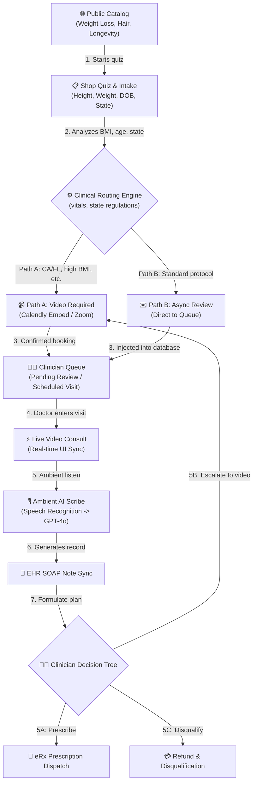
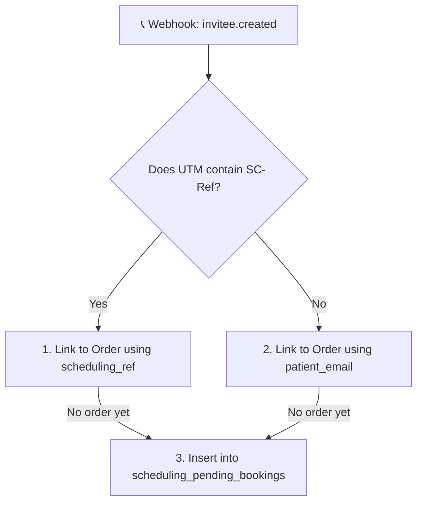

# 🏆 PEAK HEALTH: SYSTEM ARCHITECTURE & CODE INDEX

This document serves as the authoritative architectural blueprint and codebase directory index for the **Peak Health Telehealth Platform**. It maps the relationships between the frontend portals, state stores, custom routing rules, AI clinical tools, edge webhooks, and the secure Supabase database system.

---

## 🗺️ 1. END-TO-END CLINICAL SYSTEM WORKFLOW

The diagram below maps the cross-portal path from public treatment browsing to automated transcription sync and fulfillment.



---

## 📂 2. CODEBASE DIRECTORY MAP & FILE INDEX

All key code modules are categorized below by operational concern. Clicking any file name will navigate directly to its implementation.

### 🔑 A. Core Setup & App Router
*   [App.tsx](../src/app/App.tsx) — Main React entry point. Prevents production initialization crashes (circular dependencies) by eager-loading the auth and patient stores before the router graph.
*   [routes.tsx](../src/app/routes.tsx) — The centralized application router defining public pages, auth layouts, protected portal routes, and Role-Based Access Control (RBAC) screens.

### 🧠 B. State Stores (Zustand)
*   [auth-store.ts](../src/lib/auth-store.ts) — Secure session holder. Extracts user roles and brand scopes from JWT tokens (`app_metadata` with a `user_metadata` fallback) and runs asynchronous cross-checks against the public profile record. Offers `localStorage` dev overrides for staff/testing bypass.
*   [patient-store.ts](../src/lib/patient-store.ts) — Coordinates client-side patient orders, prescription updates, clinician lists, and Calendly event details.

### ⚖️ C. Clinical Workflow & Video Routing Utilities
*   [videoConsultRules.ts](../src/lib/videoConsultRules.ts) — The algorithmic brain of the clinical gate. Calculates patient age and BMI, parses state arrays from product rules or `VITE_VIDEO_REQUIRED_STATES` env variables, and matches admin-defined database routing rules.
*   [enrollVideoRouting.ts](../src/lib/enrollVideoRouting.ts) — Evaluates whether step 8 of checkout must show live Calendly widgets based on patient vitals and regulations. **Strict security requirement:** Questionnaire answers are omitted to avoid biasing the required video decision.
*   [doctorFlowArchitecture.ts](../src/lib/doctorFlowArchitecture.ts) — Maps the cross-portal clinical operating stages into descriptive icons, progress metrics, and page references for providers.

### 🏥 D. Pharmacy & Fulfillment Services
*   [orderFulfillmentRail.ts](../src/lib/orderFulfillmentRail.ts) — Tracks drug dispensing, compound inventory checkouts, shipping queues, and prescription status changes.
*   [productGateways.ts](../src/lib/productGateways.ts) — Houses the product catalog gateway, processing sub-brand mappings and discount codes.

### 🖼️ E. UI Portals (Pages)
*   **Patient Portal:**
    *   [Dashboard.tsx](../src/app/pages/patient/Dashboard.tsx) — Landing center displaying real-time clinician video call prompts, active prescriptions, step-by-step progress bars, and support tickets.
    *   [Shop.tsx](../src/app/pages/patient/pages/Shop.tsx) — Interactive dispensary checkout containing the comprehensive multi-step quiz funnel.
    *   [Appointments.tsx](../src/app/pages/patient/pages/Appointments.tsx) — Custom interface where patients manage checkups and view secure consultation links.
    *   [Consult.tsx](../src/app/pages/patient/pages/Consult.tsx) — Interactive video checkup consultation interface.
*   **Doctor Portal:**
    *   [Queue.tsx](../src/app/pages/doctor/pages/Queue.tsx) — Prioritized queue dashboard for clinicians, matching scheduled visits against asynchronous intake charts.
    *   [Consult.tsx](../src/app/pages/doctor/pages/Consult.tsx) — Comprehensive clinical charting workspace showing vitals, past allergies, and prescribing decisions (5A, 5B, 5C).
    *   [Scribe.tsx](../src/app/pages/doctor/pages/Scribe.tsx) — Voice-capture console. Integrates web speech microphones with edge services to structure SOAP visit records.
    *   [Availability.tsx](../src/app/pages/doctor/pages/Availability.tsx) — Clinician calendar coordination panel.
*   **Admin & SuperAdmin Portals:**
    *   [Questionnaire.tsx](../src/app/pages/admin/pages/Questionnaire.tsx) — Administrative panel to visually build, edit, and launch new brand intake forms.
    *   [Doctors.tsx](../src/app/pages/superadmin/pages/Doctors.tsx) — Master provider index. SuperAdmins onboard clinicians, check NPI licenses, verify states, and bind Calendly URLs.

---

## 🗄️ 3. DATABASE SCHEMA & ROW LEVEL SECURITY (RLS)

The system relies on strict Row Level Security rules inside Supabase. To avoid infinite recursion errors caused by queries querying the profiles table from within its own policy, security definer helper functions extract roles from JWT claims.

### 🛡️ RLS Helper Functions
*   [get_auth_role()](../supabase/migrations/20260514143000_production_core_rbac.sql) — Security definer function that pulls the role claim directly from the authenticated user's JWT (`app_metadata` -> `user_metadata` -> database check). Grants: `patient`, `doctor`, `pharmacy`, `brand_admin`, `super_admin`, or `affiliate`.
*   [get_auth_brand()](../supabase/migrations/20260514143000_production_core_rbac.sql) — Identifies the brand scope (e.g. `Peak Health`, `GlowRx`) of an admin user to filter catalog items and patient orders.

### 📋 Main Tables & Scopes
1.  **`profiles`**
    *   *Patient View Own:* `auth.uid() = id` (Select, Insert, Update).
    *   *Staff View All:* `get_auth_role() IN ('doctor', 'pharmacy', 'brand_admin', 'super_admin')` (Select).
    *   *SuperAdmin Manage:* `get_auth_role() = 'super_admin'` (Update clinician settings like Calendly URLs).
2.  **`orders`**
    *   *Patient View/Insert:* `auth.uid() = user_id`.
    *   *Brand Admin View/Update:* Restricts orders to same brand: `coalesce(sub_brand, '') = public.get_auth_brand()`.
    *   *Clinicians/SuperAdmin:* Unrestricted global read and update parameters (`doctor`, `pharmacy`, `super_admin`).
3.  **`products`**
    *   *Public read:* Anyone (anon/authenticated) can select active products: `coalesce(active, true) = true`.
    *   *Admin writes:* Catalog creations/updates require `brand_admin` or `super_admin`.
4.  **`admin_questionnaires`**
    *   Saves visual questionnaire designs. Scoped strictly per-brand using `brand_id = public.get_auth_brand()`.
5.  **`scheduling_pending_bookings`**
    *   Stores Calendly webhook triggers before orders are officially submitted to guarantee synchronization without race conditions. Only readable by the database `service_role`.
6.  **`consult_routing_rules`**
    *   Holds admin-defined clinical video visit rules. Readable by public anonymous checkout; managed by SuperAdmins.
7.  **`admin_audit_logs`**
    *   Implements an immutable operations audit ledger tracking administrator activities. Gated by role scopes.

---

## 🧠 4. CLINICAL ROUTING ENGINE (VIDEO VS ASYNC)

Peak Health implements a strict multi-layer gate to determine if a patient must undergo a live video consultation:

```
                  [ START CHECKOUT EVALUATION ]
                                |
                                v
                Does product features requires_video?
                 /                         \
             [YES]                         [NO]
               |                             |
      (Sync Video Required)                  v
                                Is patient in CA/FL or
                          VITE_VIDEO_REQUIRED_STATES list?
                            /                       \
                        [YES]                       [NO]
                          |                           |
                 (Sync Video Required)                v
                                            Does BMI or age exceed
                                            clinical_rules bounds?
                                              /                 \
                                          [YES]                 [NO]
                                            |                     |
                                   (Sync Video Required)          v
                                                          Check matching active
                                                        consult_routing_rules in DB.
                                                            /           \
                                                        [MATCH]       [NONE]
                                                           |             |
                                                 (Sync Video Required)  (Async Review)
```

The logic is executed dynamically by `evaluateEnrollmentVideoRouting()`. If video is required:
1.  **Step 8 of Shop Checkout** loads the doctor's Calendly booking widget.
2.  The order's `zoom_status` defaults to `'requested'`, alerting the clinician during queue review.
3.  Once the booking webhook arrives, the status transitions to `'confirmed'`, updating the patient dashboard with a clickable join link.

---

## 🎙️ 5. AI MEDICAL SCRIBE & EHR INTEGRATION

The AI Medical Scribe converts real-time consultations into structured medical documentation.

### 🔄 Data Processing Pipeline
1.  **Capture:** The browser's native `SpeechRecognition` API records ambient audio in the doctor portal's scribe view `Scribe.tsx`.
2.  **API Integration:** The voice transcript is sent to the Supabase Edge Function `ai-medical-scribe`.
3.  **GPT-4o Transformation:** If `OPENAI_API_KEY` is present, the edge function formats the transcript into a professional JSON SOAP note (Subjective, Objective, Assessment, Plan).
4.  **Clinical Heuristic Fallback:** If no API key exists, a local heuristic clinical parser translates key phrases:
    *   *Weight loss keywords (ozempic, glp-1)* $\rightarrow$ metabolic management plans & titration schedules.
    *   *Cardio keywords (pressure, heart)* $\rightarrow$ vitals and bp tracking metrics.
    *   *Fatigue keywords (tired, energy)* $\rightarrow$ laboratory panels (Vitamin D, B12, Thyroid).
5.  **EHR Synchronization:** Clicking **Synchronize EHR** inserts the formatted SOAP structure directly into the `visit_summaries` table linked to the patient chart.

---

## 📞 6. CALENDLY WEBHOOK CORE MECHANICS

To handle async checkouts and race conditions (e.g. booking before final order insert), the `calendly-webhook` edge function uses a multi-tier matching logic:



### Webhook Matching Order:
1.  **Primary Match (scheduling_ref):** Captures the `utm_content` starting with `SC-` and links it to `orders.scheduling_ref`. Sets `orders.zoom_status = 'confirmed'`, saves `zoom_join_url`, and generates patient portal notifications.
2.  **Secondary Match (patient_email):** If no reference exists, looks up the patient's email on recent active orders created in the last 14 days to update the zoom credentials.
3.  **Race-Condition Safe Buffer (scheduling_pending_bookings):** If no matching order exists in the DB, the webhook inserts a pending booking row. When checkout completes, the enrollment flow calls `merge-scheduling-pending` to consume the booking and attach the Zoom details.

---

## 🧪 7. VERIFICATION & DEPLOYMENT CHECKLIST

Use these commands to verify code compliance and database migrations:

```bash
# 1. Run local environment preflight check (API keys, ports)
npm run check:api

# 2. Run system migration checks
npm run check:engineering

# 3. Verify clinical video scheduling gates inside CI pipelines
npm run check:scheduling-gate

# 4. Trigger automated end-to-end integration test (simulates checkout and status updates)
node verify_full_system.js
```

### Production Smoke-Test Matrix:
| Persona | Access Target | Success Criteria |
| :--- | :--- | :--- |
| **Anonymous** | Shop Catalog | Selects active products only (RLS checked). |
| **Patient** | Checkout Funnel | Order inserts successfully; only sees own orders. |
| **Patient** | `/patient/appointments` | Bookings load correctly; Calendly widgets display on Zoom `'requested'`. |
| **Doctor** | Queue Screen | Only sees patients within state licensing limits. |
| **Brand Admin** | Admin Dashboard | Read/Write parameters restricted strictly to own brand (`sub_brand`). |
| **Super Admin** | SuperAdmin Console | Cross-brand access; manages all clinical listings and audit logs. |

---

> [!NOTE]
> All legacy database seeds and permissive MVP scripts are archived under `supabase/LEGACY_SQL.md` and must never be applied to production databases. Migrations under `supabase/migrations/` represent the strict authority of the database state.
