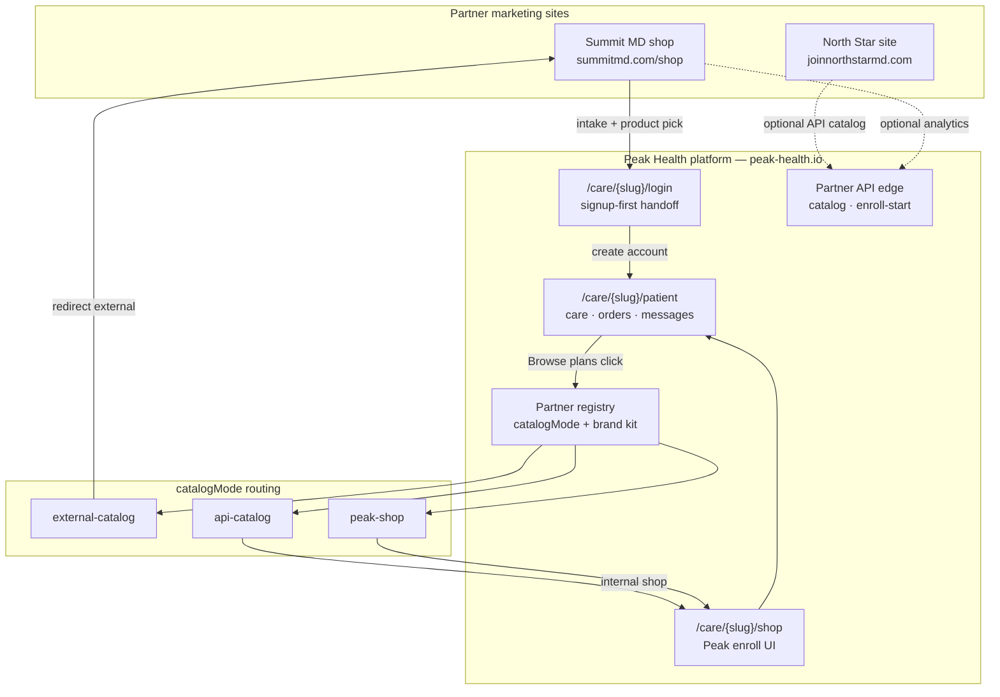
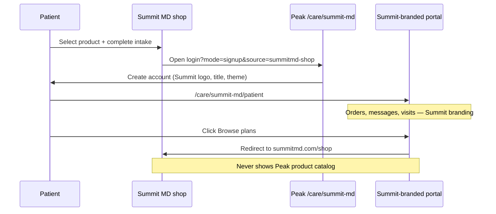

# Partner catalog & patient portal routing

Scalable model for **many brands** on one Peak Health platform. Each partner declares how products are sold; the patient portal never hardcodes `/patient/shop` or Peak marketing URLs.

## Catalog modes

| Mode | Who owns products | Shop click in portal | First enrollment |
|------|-------------------|----------------------|------------------|
| `external-catalog` | Partner marketing site (Summit MD) | → `marketingShopUrl` | Partner site → Peak signup → portal |
| `api-catalog` | Partner UI + Partner API catalog | → `/care/{slug}/shop` (Peak enroll, branded) | Partner or Peak shop |
| `peak-shop` | Peak `/care/{slug}/shop` or `/patient/shop` | → branded enroll path | Peak shop |

Register each partner in `src/lib/partners/integrations/*.ts` with `catalogMode`, `marketingShopUrl`, and `handoffSource`.

## Code map

| Layer | Responsibility |
|-------|----------------|
| `src/lib/partners/catalogRouting.ts` | `resolvePatientShopDestination()` — shop href + external flag |
| `src/lib/brands/patientNav.ts` | `usePatientNav()` — all portal paths under `/care/{slug}/patient` |
| `src/app/components/patient/PatientShopLink.tsx` | `<Link>` vs `<a>` for shop |
| `src/app/components/patient/PartnerExternalShopRedirect.tsx` | Blocks Peak catalog for external partners |
| `src/lib/brands/brandDocument.ts` | Tab title, favicon, logo from brand kit |

## Architecture diagram

## Patient journey — Summit MD (external-catalog)

## Adding a new international partner

1. **Supabase** — `brands` row + `brand_hostnames` (optional).
2. **Static kit** — `src/lib/brands/{slug}.ts` + `src/brand-sites/{slug}/site.ts` (logo URL, theme, copy).
3. **Partner integration** — `src/lib/partners/integrations/{slug}.ts`:
   - `catalogMode`: pick one of three modes above
   - `marketingShopUrl`, `handoffSource`, `defaultAuthMode: "signup"` if shop is external
4. **Register** — `registerPartner()` in `src/lib/partners/index.ts`.
5. **Portal UI** — use `usePatientNav()` and `PatientShopLink`; do not hardcode `/patient/...`.

Peak default (`peak-health` slug) is unchanged: `/patient` + `/patient/shop`.
