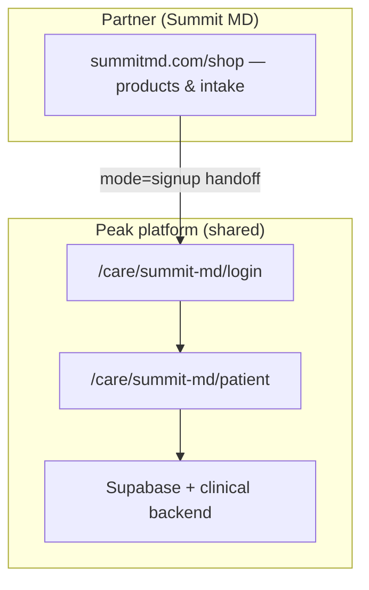

# White-label patient portal — Summit MD and partner brands

Guide for what patients see after login, what still reads as Peak Health, and what to implement later. No code changes required to read this doc — use it as the implementation checklist.

---

## Summary

Summit MD (and other partners) run on **Peak Health infrastructure** with a **tenant brand layer**:

| Layer | Summit today | Fully Summit (target) |
|-------|----------------|------------------------|
| Domain | `peak-health.io/care/summit-md/...` | `care.summitmd.com/...` (custom DNS) |
| Logo & portal name | Summit MD | Summit MD |
| Browser tab / favicon | Summit (after JS load) | Summit |
| UI colors | Mostly Peak emerald green | Summit navy / teal from `site.theme` |
| Shared copy (logout, errors) | Some “Peak Health” strings | `site.copy.portalName` everywhere |
| User name in header | Account profile (not branding) | Same |

**Important:** The name shown top-right (e.g. a patient’s first/last name) is **who is logged in**, not platform branding. If it contains “peake”, that is the user’s profile from signup — not Peak Health OS.

---

## Architecture



- **One codebase** — `src/brand-sites/{slug}/site.ts` + `src/lib/partners/integrations/{slug}.ts`
- **One host** — `peak-health.io` until custom domain is configured
- **Many brands** — resolved by URL path `/care/{slug}/`, query `brandId`, or hostname

See also: [PARTNER_CATALOG_ARCHITECTURE.md](./PARTNER_CATALOG_ARCHITECTURE.md), [README.md](./README.md).

---

## What is already Summit-branded (live)

After login at `/care/summit-md/patient`:

- Center header logo from `SUMMIT_MD_BRAND.logoUrl`
- Left label: “Your care” + **Summit MD** (`site.copy.portalName`)
- Document title: **Summit MD | Patient Portal** (`applyBrandDocumentMeta`)
- Favicon from Summit logo URL
- Shop / Browse plans → Summit marketing shop (external-catalog), not Peak product catalog
- Signup handoff clears prior session so a new user can register (`mode=signup`)

Config files:

- `src/lib/brands/summitMd.ts` — brand id, slug, logo, domains
- `src/brand-sites/summit-md/site.ts` — theme, copy, hosts
- `src/lib/partners/integrations/summitMd.ts` — `catalogMode: external-catalog`, handoff URLs

---

## What still feels like Peak (and why)

### 1. URL bar — `peak-health.io`

Patients see Peak’s domain because Vercel serves the multi-tenant app there. The path `/care/summit-md/` selects the tenant; the domain is still Peak until DNS is added.

**Later implementation — custom domain**

1. DNS: `care.summitmd.com` → CNAME to Vercel (or apex per Vercel docs)
2. Vercel: add domain to the telehealth project
3. Supabase: `brand_hostnames` row for Summit (see `RUN_IN_SUPABASE_SUMMITMD_PARTNER.sql`)
4. Already listed in `summitMdSite.hosts` — hostname resolution will pick Summit brand without path prefix

Target URL examples:

- Login: `https://care.summitmd.com/login`
- Portal: `https://care.summitmd.com/patient`

Update partner handoff URLs in Summit env to use `VITE_PARTNER_PORTAL_ORIGIN=https://care.summitmd.com` when ready.

### 2. UI colors — Peak emerald vs Summit theme

Summit theme is defined but not applied everywhere:

```typescript
// src/brand-sites/summit-md/site.ts
theme: {
  primary: "#0f2e2f",
  accent: "#00d2c4",
  headerBg: "#f9f5f0",
}
```

`applyBrandSiteTheme()` sets CSS variables (`--brand-primary`, etc.), but `AppLayout`, sidebar, and many buttons still use hardcoded Tailwind `emerald-*` (Peak default).

**Later implementation — theme pass**

- When `isWhiteLabel && isPatientPortal`, prefer `var(--brand-primary)` / `site.theme` for:
  - Header accents, notification badge, active nav, primary buttons
  - Patient dashboard cards (optional)
- Keep Peak emerald for `/patient` (Peak default) and all staff portals unchanged

Key files:

- `src/app/components/AppLayout.tsx`
- `src/app/components/Sidebar.tsx`
- `src/app/components/BottomNav.tsx`
- `src/app/pages/patient/Dashboard.tsx`

### 3. Residual “Peak Health” copy

Shared components that still mention Peak on **all** portals:

| Component | Example string |
|-----------|----------------|
| `LogoutConfirmation.tsx` | “Peak Health Secure Termination” |
| `PageErrorBoundary.tsx` | “Peak Health · Incident Auto-Logged” |
| `ErrorBoundary.tsx` | “Peak Health Infrastructure” |
| Legal defaults | `support@peak-health.io` |
| Chatbot greeting in `AppLayout` | Uses `portalName` (OK if brand resolved) |

**Later implementation — copy pass**

- Gate strings with `isWhiteLabel` + `site.copy.portalName` / `site.copy.supportEmail`
- Or add optional `site.copy.poweredByLabel` (empty for full white-label)

### 4. First paint / SEO

`index.html` still has Peak default title until React hydrates. Acceptable for SPA; optional SSR or per-route meta later.

---

## White-label levels (choose when implementing)

| Level | Description | Work |
|-------|-------------|------|
| **A — Current** | Logo, portal name, tab title, shop routing, signup session fix | Done |
| **B — Visual** | Summit colors + no Peak strings in patient shell | Code pass |
| **C — Domain** | `care.summitmd.com` | DNS + Vercel + SQL hostnames |
| **D — Legal** | Summit terms/privacy URLs in `site.copy.termsHref` | Content + routing |

Recommended order for Summit: **B → C → D**.

---

## Implementation checklist (for later)

### Platform (Peak / telehealth repo)

- [ ] Theme pass on patient shell (`AppLayout`, nav, dashboard) using `site.theme`
- [ ] Copy pass on logout, errors, boundaries when `isWhiteLabel`
- [ ] Confirm `BrandContext` applies `applyBrandDocumentMeta` on all `/care/:slug/patient/*` routes
- [ ] Optional: hide or replace left “Activity” pulse icon with brand-neutral or Summit icon
- [ ] Document custom domain steps in Summit runbook

### Infrastructure

- [ ] Deploy `partner-api` edge function (health currently 404 if not deployed)
- [ ] Vercel: add `care.summitmd.com` (or chosen host)
- [ ] Run / extend `RUN_IN_SUPABASE_SUMMITMD_PARTNER.sql` hostnames

### Summit marketing site

- [ ] Update `VITE_PARTNER_PORTAL_ORIGIN` when custom domain is live
- [ ] Step 9 handoff URL points to new origin + `/login?mode=signup&...`

### QA after implementation

- [ ] Login/signup shows Summit only (tab, logo, colors)
- [ ] Portal header has no “Peak Health” visible strings
- [ ] URL shows partner domain (if C configured)
- [ ] Second user signup in same tab does not reuse first session
- [ ] Browse plans returns to summitmd.com shop
- [ ] Peak `/patient` portal unchanged for Peak Health patients

---

## Adding the next partner (same pattern)

1. Supabase `brands` + `partner_api_keys` + optional `brand_hostnames`
2. `src/lib/brands/{slug}.ts` + `src/brand-sites/{slug}/site.ts`
3. `src/lib/partners/integrations/{slug}.ts` with `catalogMode`
4. Register in `src/lib/partners/index.ts`
5. Send engineers [README.md](./README.md) handoff packet (`partnerDevHandoffPacket(slug)`)
6. When ready: custom domain + theme/copy pass using this doc

---

## Related docs

- [PARTNER_CATALOG_ARCHITECTURE.md](./PARTNER_CATALOG_ARCHITECTURE.md) — shop vs portal routing
- [SUMMIT_MD_FRONTEND.md](./SUMMIT_MD_FRONTEND.md) — Summit shop → Peak handoff
- [PARTNER_CONNECT.md](../PARTNER_CONNECT.md) — Partner API quick start
- [PLATFORM_MASTER_GUIDE.md](../PLATFORM_MASTER_GUIDE.md) — full platform overview

---

## FAQ

**Why host on peak-health.io at all?**  
Single deploy, shared auth, HIPAA-aligned backend, faster onboarding. Partners get branded UI; Peak operates the platform. Custom domain hides the Peak hostname from patients.

**Is the patient data on Peak’s brand?**  
Orders and profiles are scoped by `brand_id` / tenant in Supabase RLS. Summit patients belong to the Summit brand row.

**Will doctor/admin portals say Summit?**  
Brand admin can use `/care/summit-md/admin`. Doctors use global `/doctor` (all brands) by design.

**Do we need a separate Summit frontend for the portal?**  
No for MVP. Optional later: iframe or link-out only if product requires it. Current model is one React app, many brand kits.
